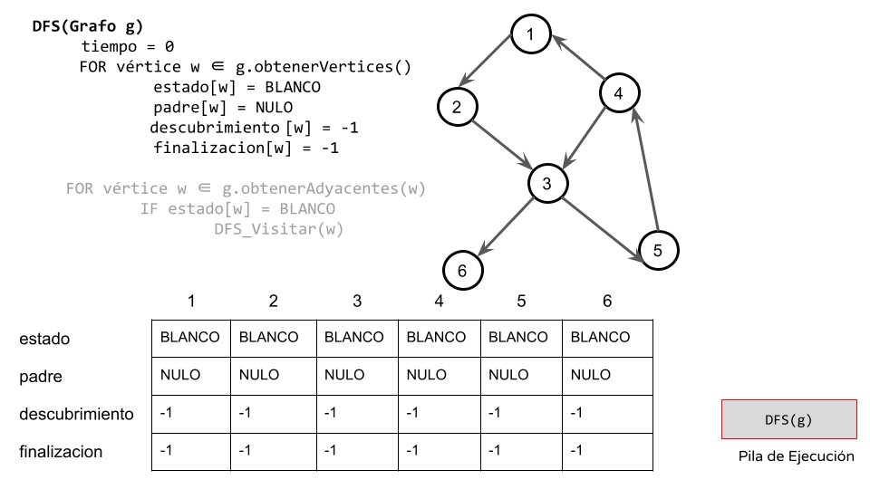

# DFS

Su funcionamiento consiste en ir recorriendo cada uno de los nodos de forma recurrente, en un camino concreto. 

Cuando ya no quedan más nodos que visitar en dicho camino, regresa, de modo que repite el mismo proceso con cada uno de los hermanos del nodo ya procesado.

```
DFS(Grafo g)
  FOR vértice w ∈ g.obtenerVertices()
        estado[w] = BLANCO
        padre[w] = NULO

  FOR vértice w ∈ g.obtenerAdyacentes(w)
          IF estado[w] = BLANCO
                DFS_Visitar(w)

DFS_Visitar(Grafo g, Vertice v)
  estado[v] = AMARILLO
  FOR u ∈ g.obtenerAdyacentes(v)
    IF estado[u] = BLANCO
      padre[u] = v
      DFS_Visitar(u)
```

# Aplicaciones: clasificación de arcos y detección de ciclos

```
DFS(Grafo g)
  tiempo = 0
     FOR vértice w ∈ g.obtenerVertices()
             estado[w] = BLANCO
             padre[w] = NULO
             descubrimiento [w] = -1
             finalizacion[w] = -1
     FOR vértice w ∈ g.obtenerAdyacentes(w)
             IF estado[w] = BLANCO
                     DFS_Visitar(w)

DFS_Visitar(Grafo g, Vertice v)
     tiempo = tiempo + 1
  descubrimiento [v] = tiempo
     estado[v] = AMARILLO
     FOR u ∈ g.obtenerAdyacentes(v)
             IF estado[u] = BLANCO
                     padre[u] = v
                     DFS_Visitar(u)
     estado[v] = NEGRO
  tiempo = tiempo + 1
  finalizacion [v] = tiempo
```
## Seguimiento



.png)

.png)


.png)


.png)

.png)

.png)

.png)

.png)

.png)

.png)

.png)

.png)

.png)

.png)

.png)

.png)

.png)

.png)

.png)

.png)

.png)


