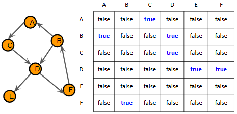
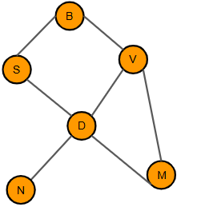
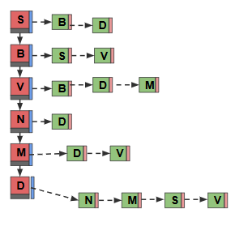
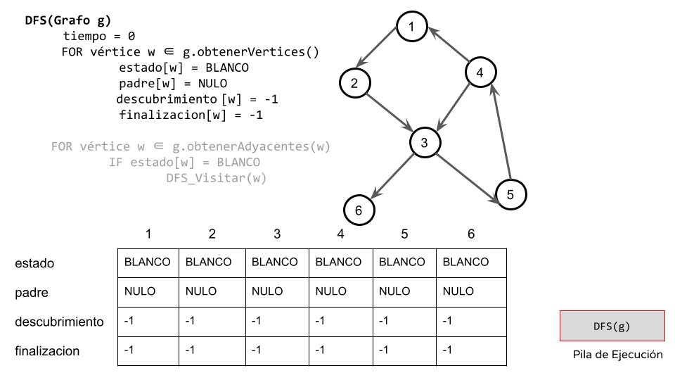

# Grafo en C++ 

Este repositorio contiene implementaciones de grafos en C++ utilizando dos enfoques diferentes:

- Matriz de adyacencias : recomendado para grafos densos.

- Lista de adyacencias: recomendado para grafos dispersos.

## Definición

En matemáticas y ciencias de la computación, un _grafo_ (del griego grafos: dibujo, imagen) es un _conjunto_ de objetos llamados vértices o nodos unidos por enlaces llamados aristas o arcos, que permiten representar re_laciones binarias_ entre elementos de un conjunto. Son objeto de estudio de la teoría de grafos. Típicamente, un grafo se representa como un conjunto de puntos (vértices o nodos) unidos por líneas (aristas o arcos).

Desde un punto de vista práctico, los grafos permiten estudiar las interrelaciones entre unidades que interactúan unas con otras. Por ejemplo, una red de computadoras puede representarse y estudiarse mediante un grafo, en el cual los vértices representan terminales y las aristas representan conexiones (las cuales, a su vez, pueden ser cables o conexiones inalámbricas). Prácticamente cualquier problema puede representarse mediante un grafo, y su estudio trasciende a las diversas áreas de las ciencias exactas y las ciencias sociales.

Formalmente un grafo se define como sigue:

G = (V,A)

V: conjunto de vértices no vacío.

A: conjunto de aristas. Cada elemento a de A es un par de vértices (v1;v2) que está en V.

## Ejemplos de uso

```cpp
Grafo<std::string, double> rutas(true);
rutas.addArco("Madrid", "Barcelona", 620.5);
rutas.addArco("Madrid", "Valencia", 350.2);
rutas.addArco("Valencia", "Barcelona", 300.1);
```

Un **grafo etiquetado** es un grafo G = (V,E) sobre el que se define una función f: A -> E, donde E es un conjunto cuyas componentes se llaman etiquetas.

En ocasiones, las aristas pueden tener asociado un peso, que muestra el costo de ir de un vértice a otro. Llamamos a esos grafos, grafos **ponderados**. Cuando la arista no tiene un peso asociado, consideraremos que el costo de esa arista es 1.

Ponderación: corresponde a una función que a cada arista le asocia un valor (costo, peso, longitud, etc.), para aumentar la expresividad del modelo. Esto se usa mucho para problemas de optimización, como el del vendedor viajero o del camino más corto.

## Grafo No Dirigido

GND = (V,A)

V conjunto de Vertices

V = {A, B, C, D, E, F}

A conjunto de aristas. Cada elemento de A es un par NO ORDENADO de vertices de V

## Grafo Dirigido

GD = (V,A)

V conjunto de Vertices

V = {A, B, C, D, E, F}

A conjunto de aristas. Cada elemento de A es un par ORDENADO de vértices de V

### Operaciones principales

Sea cual sea el grafo, responde a las siguientes (operaciones)[Grafo.hpp]

| **Operación**      | **Descripción**                | 
| ------------------ | ------------------------------ | 
| `addVertice(v)`    | Agrega un vértice              | 
| `addArco(u,v,c)`   | Inserta arista con costo       | 
| `hayArco(u,v)`     | Consulta si existe arista      | 
| `getAdyacentes(u)` | Devuelve lista de vecinos      | 
| `getCosto(u,v)`    | Devuelve costo de la arista    | 

## Representaciones 

De forma general, podemos representar un grafo con una [matriz de adyacencias](GrafoMA.tpp) (grafos densos) o una [lista de adyacencias (GrafoLA.tpp) (grafos disperos).

Matriz de adyacencias. Grafo dirigido



Lista de adyacencias 




```cpp
Grafo<char, int> g(3, true);
g.addVertice('A');
g.addVertice('B');
g.addArco('A', 'B', 5);
g.imprimir();
```

Matriz de adyacencias - Salida

```
[A] [B]
[A] 0 5
[B] 5 0
```

Ventaja: acceso rapido para consultas de aristas.
Desventaja: ocupa mucha memoria

Lista de adyacencias - Salida

```
A: {(B:5)}
B: { }
```
Ventaja: ocupa menos memoria que la matriz.
Desventaja: complejidad lineal para consulta de arcos

Una mejora consiste en usar un [mapa](img/GrafoLAM.tpp)

```
{
    1: {2: 5, 3: 7},
    2: {3: 2},
    3: {}
}
```

## DFS

Su funcionamiento consiste en ir recorriendo cada uno de los nodos de forma recurrente, en un camino concreto. 

Cuando ya no quedan más nodos que visitar en dicho camino, regresa, de modo que repite el mismo proceso con cada uno de los hermanos del nodo ya procesado.

```
DFS(Grafo g)
  FOR vértice w ∈ g.obtenerVertices()
        estado[w] = BLANCO
        padre[w] = NULO

  FOR vértice w ∈ g.obtenerAdyacentes(w)
          IF estado[w] = BLANCO
                DFS_Visitar(w)

DFS_Visitar(Grafo g, Vertice v)
  estado[v] = AMARILLO
  FOR u ∈ g.obtenerAdyacentes(v)
    IF estado[u] = BLANCO
      padre[u] = v
      DFS_Visitar(u)
```

# Aplicaciones: clasificación de arcos y detección de ciclos

```
DFS(Grafo g)
  tiempo = 0
     FOR vértice w ∈ g.obtenerVertices()
             estado[w] = BLANCO
             padre[w] = NULO
             descubrimiento [w] = -1
             finalizacion[w] = -1
     FOR vértice w ∈ g.obtenerAdyacentes(w)
             IF estado[w] = BLANCO
                     DFS_Visitar(w)

DFS_Visitar(Grafo g, Vertice v)
     tiempo = tiempo + 1
  descubrimiento [v] = tiempo
     estado[v] = AMARILLO
     FOR u ∈ g.obtenerAdyacentes(v)
             IF estado[u] = BLANCO
                     padre[u] = v
                     DFS_Visitar(u)
     estado[v] = NEGRO
  tiempo = tiempo + 1
  finalizacion [v] = tiempo
```
## Seguimiento



.png)

.png)


.png)


.png)

.png)

.png)

.png)

.png)

.png)

.png)

.png)

.png)

.png)

.png)

.png)

.png)

.png)

.png)

.png)

.png)

.png)


